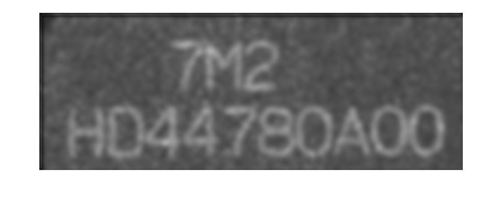
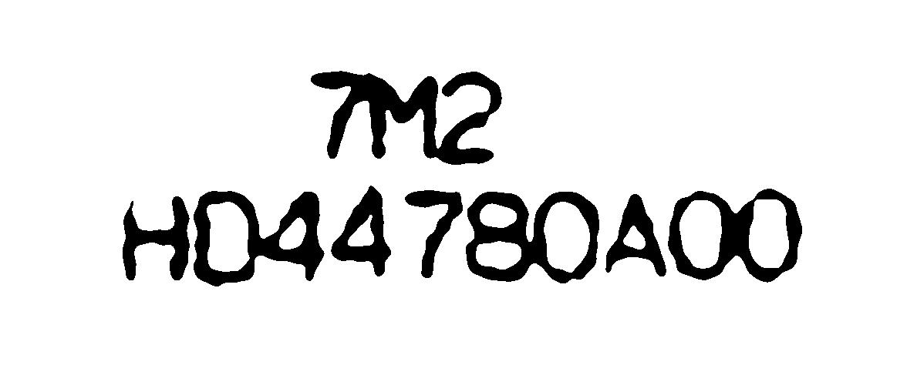

# Modules added:
1. Averaging filter
2. Averaging with rotating filter
3. Thresholding function

# Output:
### Original image

### After averaging mask

### After averaging using rotating mask

### After thresholding 

### After edge detection

